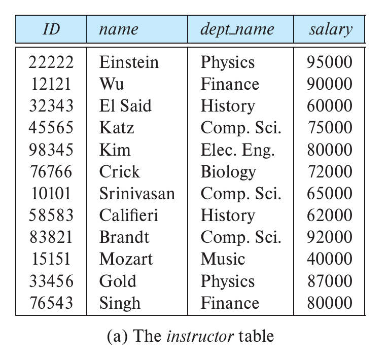
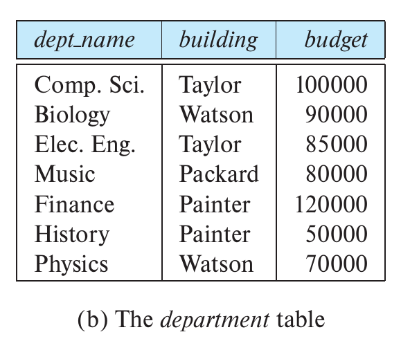
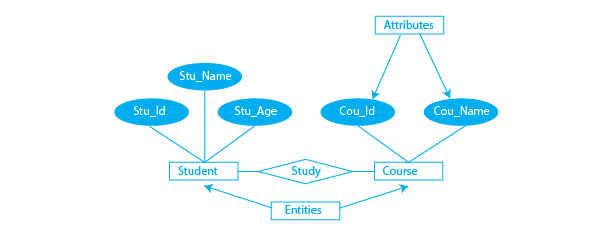

# LECTURE SHEET 02: Data Models and the Relational Model. Relations, Tuples, Keys, Schema vs Instance

**Course:** CSE 3523 – Database Management Systems  
**Module:** 1 (The Foundation)  
**Duration:** 1 Hour 20 Minutes  

**Primary Reference:**  
[S] Silberschatz, Korth, & Sudarshan, *Database System Concepts* (7th Edition), Chapter 1  

**Secondary References:**  
[K] Kleppmann, Riccomini – Designing Data-Intensive Applications, 2nd Edition
[AP] Dimitri Fontaine, *The Art of PostgreSQL*

---

# Data Models

Underlying the structure of a database is the data model: a collection of conceptual tools for describing data, relationships, semantics, and consistency constraints.

Data models can be classified into four categories:

* **Relational Model.** The relational model uses a collection of tables to represent data and relationships. Each table has multiple columns (also called field or attribute) with unique names. Tables are also known as relations. Each row represents one piece of information known as record. It is a record-based model where the database is structured in fixed-format records. Each record type defines a fixed number of attributes. The relational model is the most widely used data model.
Example tables:
    * **Instructor**: shows instructor details such as ID, name, department, and salary.
    * **Department**: shows department details such as department name, building and budget.
 
 

* **Entity-Relationship Model.**  The entity-relationship (E-R) data model uses a collection of basic objects, called entities,and relationships among these objects. An entity is a “thing” or “object” in the real world that is distinguishable from other
objects. The entity-relationship model is widely used in database design.

* **Semi-structured Data Model.** The semi-structured data model permits the specifi cation of data where individual data items of the same type may have different sets of attributes. This is in contrast to the data models mentioned earlier, where
every data item of a particular type must have the same set of attributes. JSON and Extensible Markup Language (XML) are widely used semi-structured data represen tations. 
    <code>
    {
    "student": {
        "student_id": "S101",
        "name": "Rahim Uddin",
        "email": "rahim@example.com",
        "date_of_birth": "2005-03-15",
        "department": {
        "dept_name": "CSE",
        "building": "Academic Building-2",
        "budget": 5000000
        }
    }
    }
    </code>
---

    <student>
        <student_id>S101</student_id>
        <name>Rahim Uddin</name>
        <email>rahim@example.com</email>
        <date_of_birth>2005-03-15</date_of_birth>
        <department>
            <dept_name>CSE</dept_name>
            <building>Academic Building-2</building>
            <budget>5000000</budget>
        </department>
    </student>

* **Object-Based Data Model.**  Object-oriented programming (especially in Java, C++, or C#) has become the dominant software-development methodology. This led initially to the development of a distinct object-oriented data model, but today the
concept of objects is well integrated into relational databases. Standards exist to store objects in relational tables. Database systems allow procedures to be stored in the database system and executed by the database system. This can be seen as
extending the relational model with notions of encapsulation, methods, and object identity. 

A large portion of database applications is based on the relational model.

## Instances and Schemas

Databases change over time. The collection of information stored in the database at a particular moment is called an **instance** of the database. The overall design of the database is called the **schema**.

Database systems have multiple schemas:

* **Physical schema** – describes design at the physical level.
* **Logical schema** – describes design at the logical level.
* **View schema (subschema)** – describes different user views.

The logical schema is most important for applications. The physical schema can be changed without affecting applications (physical data independence).

Poor schema design may cause duplicated information. For example, storing department budget in instructor records would require updating many records when the budget changes.

## Database Languages
A database system provides a data-definition language (DDL) to specify the database schema and a data-manipulation language (DML) to express database queries and up dates. In practice, the data-definition and data-manipulation languages are not two sep
arate languages; instead they simply form parts of a single database language, such as the SQL language. Almost all relational database systems employ the SQL language.

### Data-Definition Language
We specify a database schema by a set of definitions expressed by a special language called a data-definition language (DDL). The DDL is also used to specify additional properties of the data.
SQL provides a rich DDL that allows one to define tables with data types and integrity constraints. For instance, the following SQL DDL statement defines the department table:
<code>create table department
(dept name char (20),
building char (15),
budget numeric (12,2));
</code>
Execution of the preceding DDL statement creates the department table with three columns: dept name, building, and budget, each of which has a specific data type asso ciated with it. 

### Data-Manipulation Language
Adata-manipulation language (DML) is a language that enables users to access or manipulate data as organized by the appropriate data model. The types of access are:
* Retrieval of information stored in the database.
* Insertion of new information into the database. 
* Deletion of information from the database.
* Modification of information stored in the database.

There are basically two types of data-manipulation language:
* Procedural DMLs require a user to specify what data are needed and how to get those data.
* Declarative DMLs (also referred to as nonprocedural DMLs)requireausertospecify what data are needed without specifying how to get those data.
Declarative DMLs are usually easier to learn and use than are procedural DMLs.
However, since a user does not have to specify how to get the data, the database system
has to figure out an efficient means of accessing data.
A query is a statement requesting the retrieval of information. The portion of a
DMLthatinvolvesinformationretrievaliscalledaquerylanguage.Althoughtechnically
incorrect, it is common practice to use the terms query language and data-manipulation
language synonymously.
There are a number of database query languages in use, either commercially or
experimentally.